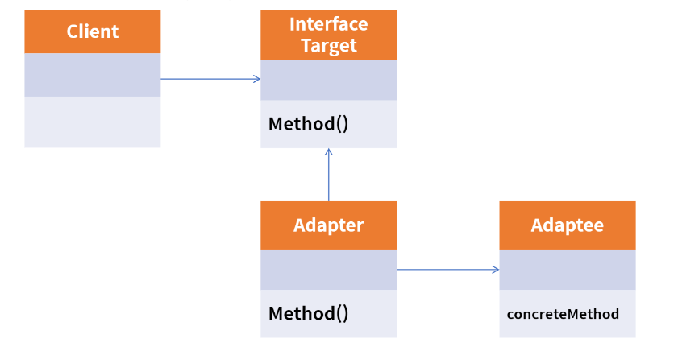
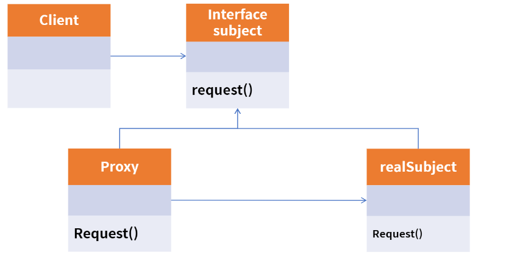
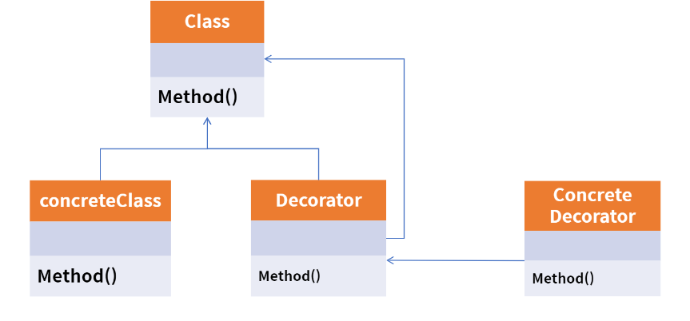
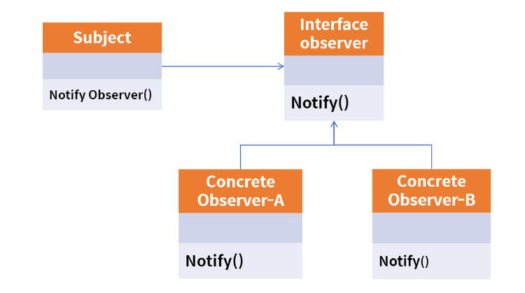
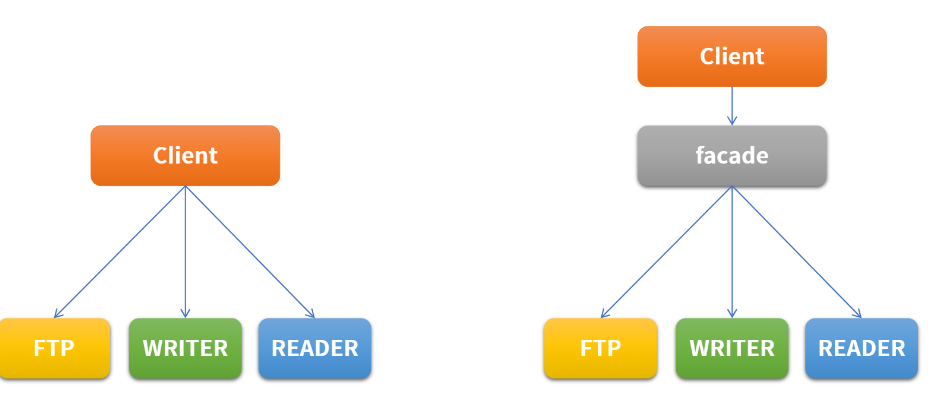
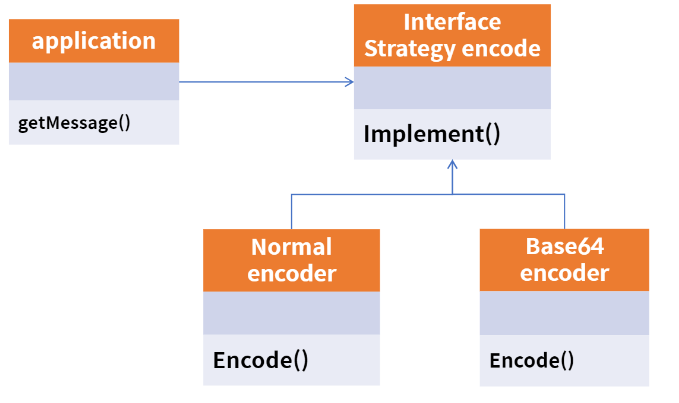

# 정리
복습하기 위해 패스트캠퍼스 java-spring 완전정복을 공부하면서 정리한 Repository


# 객체지향의 등장

객체지향의 개념은 1970년대에 들어 용어가 나옴.
* 이전에는 c언어처럼 순서대로 명령어를 처리함 -> 절차지향 
* 절차지향의 문제점 - 프로그램의 복잡도가 증가하면서 이에 유지보수, 개발기간 등 다양한 부분에서 비효율이 발생
* 객체지향의 특성
  * 추상화
  * 상속
  * 은닉
  * 재사용
  * 인터페이스

* 현실의 사물을 그대로 모델링하여 행위와 속성을 정의
* 사물 - 객체
* 사물의 행위 - 메소드
* 사물의 속성 - 변수 

## 객체의 3가지요소
* 상태 유지 (객체의 상태)
  * 상태정보를 저장하고 유지되어져야 하며 속성은 변수로 정의 되어져야 한다. 속성값이 바뀜으로 인하여 객체의 상태가 변경될 수 있어야 한다

* 기능 제공 (객체의 책임) 
  * 객체는 기능 제공해야함 - 메소드로 제공
  * 캡슐화와 연관이 있으며, 외부로 부터 직접 속성을 접근하지 않고, 제공하는 메소드로 기능이 제공 되어야함

* 고유 식별자 제공(객체의 유일성) 
  * 각각의 객체는 고유한 식별자를 가져야 한다.(ex unique, primary key)


## 객체지향의 4대 특성

1. 캡슐화
 * 객체의 속성을 보호하기 위해서 사용
 * getter / setter method
 * CRUD method
 * Business Logic Method
 * 생명주기 처리 method
   * destory(), disconnect(), quit()
 * 객체의 영구성 관리 method - private method 
   * 외부에서 접근이 불가능하도록 하고, 내부의 다른 메소드를 통해서 사용되도록 한다. 
 * 장점 : 추상화 제공, 재 사용성 향상 - 유지보수 효율성 향상 
 * 무결성 
   * 변수 : private, method public (보통의경우)
   * public method는 입력되 ㄴ매개변수를 validation 한 후 실행하는 것을 기본으로 한다.    
   

2. 상속
* 객체지향에서의 상속은, 속성의 상속이 아닌, 하위로 내려갈 수록 구체화 되는 것
* 상속의 효과
  * 프로그램 구조에 대한 이해도 향상
    * 최상위 클래스 구조를 보고, 하위 클래스 동작 이해 가능
  * 재사용성 향상
    * 해당 클래스에 필요한 속성 및 메소드를 모두 정의 하지 않고, 상속 받아서 사용 가능
  * 확장성 향상
    * 일관된 형태의 클래스 객체를 추가 할 수 있어, 간단하게 프로그램 확장 가능
  * 유지보수성 향상
    * 일관된 형태로 작성이 가능

3. 다형성
* 하나의 개체가 여러개의 형태로 변화하는것.
* 오버라이딩 통해서 가능  

4. 추상화
* 객체지향에서 추상화는 모델링
* 공통적인 부분, 특정 특성을 분리해서 재조합 하는 부분이 추상화
* 앞에서 배운 다형성, 상속 모두 추상화에 속함     


# 객체지향 설계 5원칙 SOLID 

1. SRP(Single Responsibility Principle) - 단일 책임 원칙
* 어떠한 클래스를 변경해야 하는 이유는 한 가지 뿐이여야 한다. 

2. OCP( Open Closed Principle) - 개방 폐쇄 원칙
* 자신의 확장에는 열려 있고, 주변의 변화에 대해서는 닫혀 있어야 한다.
* 상위 클래스 또는 인터페이스를 중간에 둠으로써, 자신의 변화에 대해서는 폐쇠적이지만, 인터페이스는 외부의 변화에 대해서 확장을 개방해 줄 수 있다.

* JDBC, Mybatis, Hibernate등 에서 찾아 볼 수 있다.

3. LSP(Liskov Substitution Principle) 리스코프 치환 원칙
* 서브 타입은 항상 자신의 상위 타입으로 교체할 수 있어야 한다. 


4. ISP (Interface Segregation Principle) 인터페이스 분리 원칙
* 클라이언트는 자신이 사용하지 않는 메서드에 의존 관계를 맺으면 안된다.
* 프로젝트 요구 사항과 설계에 따라서 SRP / ISP 를 선택한다. 

5. DIP (Dependency Inversion Principle) 의존성 역전 원칙
* 자신보다 변하기 쉬운 것에 의존하지 말아야 한다. 


# POJO Java?

POJO (Plain Old Java Object)
순수한 자바 오브젝트 

## 특징
1. 특정 규약에 종속되지 않는다.
   * 특정 Library, Module에서 정의된 클래스를 상속 받아서 구현하지 않아도 됨. 
   * POJO가 되기 위해서는 외부에 의존성을 두지 않고 순수한 JAVA로 구성해야함.
     
2. 특정 환경에 종속되지 않는다. 
    * 만일 특정 비즈니스 로직을 처리하는 부분에 외부 종속적인 http request, session등 POJO를 위배한 것으로 간주 
    * @Anotation 기반으로 설정하는 부분도 엄연히는 POJO라고 볼 수 없다. 


# 디자인 패턴

자주 사용하는 설계 패턴을 정형화 해서 이를 휴형별로 가장 최적의 방법으로 개발을 할 수 있도록 정해둔 설계  
알고리즘과 유사 하지만, 명확하게 정답이 있는 형태는 아니며 프로젝트의 상황에 맞추어 적용 가능 하다.

### Gof 디자인 패턴
SW를 설계할 때는 기존에 경험이 매우 중요. 그러나 모든 사람들이 다양한 경험을 가지고 있을 수는 없다.  
이러한 지식을 공유하기 위해서 나온것이 GOF의 디자인 패턴. 
총 23가지다.


## 디자인 패턴의 장점
* 개발자(설계자)와의 원활한 소통
* 소프트웨어 구조 파악 용이
* 재사용을 통한 개발 시간 단축
* 설계 변경 요청에 대한 유연한 대처 

## 디자인 패턴의 단점
* 객체지향 설계 / 구현
* 초기 투자 비용 부담 

# 디자인 패턴의 종류들

## 생성 패턴
객체를 생성하는 것과 관련된 패턴으로, 객체의 생성과 변경이 전체 시스템에 미치는 영향을 최소화 하고, 코드의 유연성을 높여 준다.

* Factory Method
* Singleton
* Prototype
* Builder
* Abstract Factory
* Chaining

## 구조 패턴
프로그램 내의 자료구조나 인터페이스 구조 등 프로그램 구조를 설계하는데 활용  
클래스, 객체들의 구성을 통해 더 큰 구조를 만들 수 있게 해줌   

* Adapter
* Composite
* Bridge
* Decorator
* Facade
* Flyweight
* Proxy

## 행위 패턴

반복적으로 사용되는 객체들의 상호작용을 패턴화한 것으로, 클래스나 객체들이 상호작용하는 방법과 책임을 분산하는 방법을 제공. 행위 패턴은 행위 관련 패턴을 사용하여 독립적으로 일을 처리하고자 할 때 사용

* Template Method
* Interpreter
* Iterator
* Observer
* Strategy
* Visitor
* Chain of responsibility
* Command
* Mediator
* State
* Memento


# Singleton Pattern
싱글톤 패턴은 어떠한 클래스(객체)가 유일하게 1개만 존재할 때 사용

이를 주로 사용하는 곳은 서로 자원을 공유 할 때 사용하는데, 실세계에서는 프린터가 해당, 실제 프로그래밍에서는 TCP Socket 통신에서 서버와 연결된 connect 객체에 주로 사용

```java
public class SocketClient {

    private static SocketClient socketClient = null;

    // default 생성자 막기
    private SocketClient(){}

    public static SocketClient getInstance(){

        if(socketClient == null){
            socketClient = new SocketClient();
            System.out.println("socket new instance");
        }

        return socketClient;
    }

    public void connect(){
        System.out.println("socket");
    }

}

```
# Adapter Pattern

호환성이 없는 기존 클래스의 인터페이스를 변환하여 재사용 할 수 있도록 한다.  
SOLID중에서 개방 폐쇄의 원칙(OCP)를 따른다.



# Proxy Pattern

Proxy는 대리인 이라는 뜻으로써, 뭔가를 대신해서 처리하는 것
Proxy Class를 통해서 대신 전달 하는 형태로 설계 되며, 실제 Client는 Proxy로부터 결과를 받는다. - Cache의 기능오로도 활용 가능  
SOLID 중에서 개방 폐쇄의 원칙(OCP)와 의존 역전 원칙(DIP)를 따름.



# Decorator pattern

데코레이터 패턴은 기존 뼈대 (클래스)는 유지하되, 이후 필요한 형태로 꾸밀 때 사용. 확장이 필요한 경우 상속의 대안으로도 활용.  
SOLID중에서 개방 폐쇄 원칙(OCP)와 의존 역전 원칙(DIP)를 따른다. 



# Observer Pattern

변화가 일어 났을 때, 미리 등록된 다른 클래스에 변화를 통포해주는 패턴.  
주로 event listener에서 해당 패턴 사용 




# Facade Pattern

여러개의 객체와 실제 사용하는 서브 객체 사이에 복잡한 의존 관계가 있을 때, 중간에 facade라는 객체를 두고, 여기서 제공하는 interface만을 활용하여 기능을 사용하는 방식.





# Strategy Pattern

전략 패턴, 객체지향의 꽃.  
유사한 행위들을 캡슐화하여, 객체의 행위를 바꾸고 싶은 경우 직접 변경하는 것이 아닌 전략만 변경하여, 유연하게 확장  
SOLID중에서 계방패쇄 원칙(OCP)와 의존 역전 원칙(DIP)를 따른다.


전략 메서드를 가진 전략 객체 (Nomal Strategy, Base6 Strategy)  
전략 객체를 사용하는 컨텍스트(Encoder)  
전략 객체를 생성해 컨텍스트에 주입하는 클라이언트 


# Web 개론

Web이란?

* World Wide Web (WWW, W3)
* Web Site - google, naver, daum, facebook 등
* API * Web Service - Kakao Open API, Google Open API, Naver Open API
* User Interface - Chrome, Safari, Explorer, Smart Watch, IP TV등


# REST

REST( Representational State Transfer : 자원의 상태 전달) - 네트워크 아키텍처
REST 규약이 있다.

1. Client, Server : 클라이언트와 서버가 서로 독립적으로 분리 되어 있어야 한다.
2. Stateless : 요청에 대해서 클라이언트의 상태를 서버에 저장하지 않는다.
3. Cache : 클라이언트는 서버의 응답을 Cache(임시저장) 할 수 있어야 한다. 클라이언트가 Cache를 통해서 응답을 재사용할 수 있어야 하며, 이를 통해서 서버의 부하를 낮춘다.
4. 계층화(Layered System) : 서버와 클라이언트 사이에, 방화벽, 게이트웨이, Proxy등 다양한 계층 형태로 구성이 가능해야 하며, 이를 확장 가능 해야 한다.
5. 인터페이스 일관성: 인터페이스의 일관성을 지키고, 아키텍처를 단순화시켜 작은 단위로 분리하여 클라이언트, 서버가 독립적으로 개선 될 수 있어야 한다.
6. Code on Demand(Optional) : 자바 애플릿, 자바스크립트, 플래시 등 특정한 기능을 서버로 부터 클라이언트가 전달받아 코드를 실행할 수 있어야 한다.

## 다음의 인터페이스 일관성이 잘 지켜졌는지에 따라, REST를 잘 사용했는지 판단을 할 수 있다.

1. 자원의 식별
* https://foo.co.kr/user/100
  * Resource : user
  * 식별자 : 100 


2. 메시지를 통한 리소스 조작
* Web에서는 다양한 방식으로 데이터를 전달할 수 있다.
  * 가장 많이 사용하는 방식 - HTML, XML, JSON, TEXT  

* 어떠한 타입의 데이터인지 알려주기 위해  
  * HTTP Header 부분에 content-type을 통해서 데이터 타입 지정

* 데이터 전체를 전달하지 않고, 이를 메시지로 전달한다.  

* > ex) 서버의 user라는 정보의 전화번호를 처음에는 number라고 결정했고, 이 정보를 Client와 주고 받을 때 그대로 사용하고 있엇다면 후에 서버의 resource 변경으로 phone-number로 바뀌게 된다면 client는 처리하지 못하고 에러가 난다.  

이러한 부분을 방지하기 위하여 별도의 메시지 형태로 데이터를 주고 받으며, client-server가 독립적으로 확장 가능하도록 한다. 


3. 자기 서술적 메시지
* 요청하는 데이터가 어떻게 처리 되어져야 하는지 충분한 데이터를 포함 할 수 있어야 한다. 

* HTTP기반의 REST에서는 HTTP Method와 Header 정보, 그리고 URI의 포함되는 정보로 표현할 수 있다.

* GET: https://foo.co.kr/user/100 - 사용자의 정보 요청
* POST: https://foo.co.kr/user - 사용자의 정보 생성
* PUT: https://foo.co.kr/user - 사용자의 정보 생성 및 수정
* DELETE: https://foo.co.kr/user/100 - 사용자의 정보 삭제
 

4. 애플리케이션 상태에 대한 엔진으로써 하이퍼미디어 

* REST API를 개발할 때 단순히 Client 요청에 대한 데이터만 응답 해주는 것이 아닌 관련된 리소스에 대한 Link 정보까지 같이 포함 되어져야 한다.

* 이러한 조건들을 잘 갖춘 경우 Rest ful 하다고 표현하고, 이를 REST API라고 한다.


# URI 설계 패턴

1. URI (Uniform Respource Identifier)
  * 인터넷에서 특정 자원을 나타내는 주소값. 해당 값은 유일(응답은 달라질 수 있다.)
  * 요청 : https://www.foo.co.kr/resource/sample/1
  * 응답 : abcd.pdf, abd.pdf.doc

2. URL (Uniform Resource Locator)
  * 인터넷 상에서의 자원, 특정 파일이 어디에 위치하는지 식별 하는 주소
  * 요청 : https://www.foo.co.kr/abcd.pdf

URL은 URI의 하위 개념 

## URI 설계 원칙
* 슬래시 구분자(/)는 계층 관계를 나타낼 때 사용
* URI 마지막 문자로 (/)는 포함하지 않는다.
* 하이픈(-)은 URI 가독성을 높이는데 사용한다.
* 밑줄(_)은 사용하지 않는다.
* URI 경로에는 소문자가 적합하다
* 파일 확장자는 URI에 포함하지 않는다.
* 프로그래밍 언어에 의존적인 확장자를 사용하지 않는다(ex .do, .jsp 등)
* 구현에 의존적인 경로를 사용하지 않는다. 
* 세션 ID를 포함하지 않는다.
* 프로그래밍 언어의 Method명을 이용하지 않는다.
* 명사에 단수형 보다는 복수형을 사용해야 한다.
* 컨트롤러 이름으로는 동사나 동사구를 사용한다.
* CRUD 기능을 나타내는 것은 URI에 사용하지 않는다.
* API에 있어서 서브 도메인은 일관성있게 사용해야 한다.
* 클라이언트 개발자 포탈 서브 도메인은 일관성 있게 만든다.


