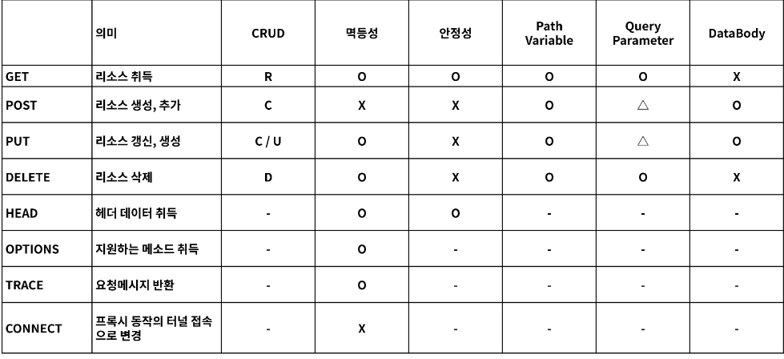
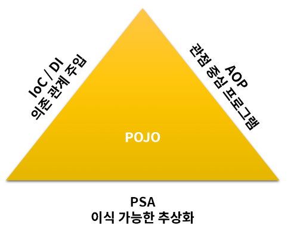

# 스프링 부트 정리

* Spring Boot는 단순히 실행되며, 프로덕션 제품 수준의 스프링 기반 어플리케이션을 쉽게 만들 수 있다.
* Spring Boot App에서는 Spring 구성이 거의 필요하지 않다.
* Spring Boot java -jar로 실행하는 Java App을 만들 수 있다

* Spring 개발에 대해 빠르고, 광범위하게 적용할 수 있는 환경
* 기본값 설정이 있지만, 설정을 바꿀 수 있다.
* 대규모 프로젝트에는 공통적인 비 기능 제공
* XML 구성 요구사항이 전혀 없음.


* ## Build Tool
    * Maven
    * Gradle

# GET API

* 

## Get 관련 어노테이션

* @GetMapping - Get Resource 설정
* @RequestParam - URL Query Param Parsing
* @PathVariable - URL Path Variable Parsing
* Object - Query Param Object로 Parsing
* @RestController - RestApi 컨트롤러 설정
* @RequestMapping - 리소스를 설정 (Method로 구분 가능)

# POST API

* @PostMapping - Post Resource 설정
* @JsonProperty - json naming
* @JsonNaming - class json naming

# PUT API

* @PutMapping - Put Resource 설정
* @RequestBody - Request Body 부분 Parsing
* @PathVariable - URL Path Variable Parsing

# DELETE API

* @DeleteMapping - Delete Resource 설정

# Response 응답 내려주기

* String - 일반 text type 응답
* Object - 자동으로 Json 변환되어 응답 상태값은 항상 200 OK
* ReponseEntity - Body 내용을 Object로 설정 상황에 따라서 Http status code 설정
* @ResponseBody - RestController가 아닌곳(Controller)에서 Json 응답을 내릴 때

# 스프링 조금 더 들여다보기 - 스프링 핵심

* 스프링 프레임워크의 구성은 20여가지로 구성.
* 이러한 모듈들은 스프링의 핵심기능 (DI, AOP, etc)를 제공해주며, 필요한 모듈만 선택하여 사용 가능.

* 현재 단일 아키텍처(모놀리스) 마이크로 서비스 아키텍처로 변환중. 여기에 맞춰 스프링도 진화하고 있는 상태.

* 여러가지 모듈 중 단연 스프링 부트, 스프링 클라우드, 스프링 데이터, 스프링 배치, 스프링 시큐리티에 중점을 둔다.

* 스프링의 과제는 '테스트의 용이성','느슨한 결합'에 중점을 두고 개발
* IOC의 등장
    * 스프링이 다른 프레임워크와 가장 큰 차이점이 IOC를 통한 개발 진행

* AOP
    * AOP를 사용하여 로깅, 트랙잭션 관리, 시큐리티 적용 등 AspectJ와 같이 완벽하게 구현된 AOP와 통합하여 사용 가능 하다.



# IOC / DI

## IOC (Inversion of Control)

* 스프링에서는 일반적인 Java 객체를 new로 생성하여 개발자가 관리하는 것이 아닌 Spring Container에 모두 맡긴다.
    * 즉 개발자에서 -> 프레임워크로 제어의 객체 관리의 권한이 넘어갔으므로 제어의 역전 이라고 한다.

## DI(Dependency Injection)

### DI 장점

* 의존성으로 부터 격리시켜 코드 테스트에 용이
* DI를 통하여 불가능한 상황을 Mock과 같은 기술을 통하여 안정적 테스트 가능
* 코드를 확장하거나 변경 할 때 영향을 최소화 한다 (추상화)
* 순환참조를 막을 수 있다.

# AOP

관점 지향 프로그램

* 스프링 어플리케이션은 대부분 특별한 경우 제외하고는 MVC 웹 어플리케이션에서는 Web Layer(), Business Layder(서비스), Data Layer(레포지토리)가 있다.


* Web Layer : REST API 제공하며 , Client 중심의 로직 적용
* Business Layer : 내부 정책에 따른 logic을 개발하며 주로 해당 부분 개발
* Data Layer : 데이터 베이스 및 외부 연동 처리

## 주요 어노테이션

* @Aspect : 자바에서 널리 사용하는 AOP 프레임워크에 포함, AOP를 정의하는 class에 할당
* @Pointcut : 기능을 어디에 적용시킬지, 메소드? Annotation? 등 AOP를 적용 시킬 지점을 설정
* @Before : 메소드 실행하기 이전
* @After : 메소드가 성공적으로 실행 후, 예외가 발생 되더라도 실행
* @AfterReturing : 메소드 호출 성공 실행 시 (Not Throws)
* @AfterThrowing : 메소드 호출 실패 예외 발생 (Throws)
* @Around : Befroe / after 모두 제어

### gradle 기준 의존성 추가방법

* `implementation 'org.springframework.boot:spring-boot-starter-aop'`

* aop를 이용할때 포인트컷 메소드를 작성해서 적용 시켜야 함.
* 범위 적용 시킬때, 포인트컷 관련 문서 찾아볼 것

```java
@Pointcut("execution(* com.example.aop.controller..*.*(..))")
    private void cut() {

    }
```

# 여러가지 어노테이션

* @SpringBootApplication : Spring boot application으로 설정
* @Controller : View를 제공하는 controller로 설정
* @RestController : REST API를 제공하는 controller로 설정
* @RequestMapping : URL 주소를 맵핑
* @GetMapping : Http GetMethod URL 주소 맵핑
* @PostMapping : Http PostMethod URL 주소 맵핑
* @DeleteMapping Http DeleteMethod URL 주소 맵핑
* @RequestParam : URL Query Parameter 맵핑
* @RequestBody : Http Body를 Parsing 맵핑
* @Valid : POJO Java class의 검증
* @Aspect : AOP 적용시 사용
* @Before AOP 메소드 이전 호출 지정
* @After : AOP 메소드 호출 이후 지정 예외 발생 포함
* @Around : AOP 이전/이후 모두 포함 예외 발생 포함
* @AfterReturning : AOP 메소드의 호출이 정상일 때 실행
* @AfterThrowing : AOP시 해당 메소드가 예외 발생시 지정

### Bean과의 Component의 차이

@Bean 은 클래스에 붙일 수 없다. @Component는 붙일 수 있다.  
@Bean은 주로 메소드 에 붙인다. 

